# Assignment 1 Report

## Running Instructions
### Synchronize uv virtual environment
```bash
uv sync --python 3.14
```

### Run assignment 1
```bash
# Run sanity check
uv run python assignments/assignment_1/assignment_1.py --config assignments/assignment_1/sanity_check.yaml

# Run energy and phase portrait plots given system parameters (num of spokes, incline angle, etc)
uv run python assignments/assignment_1/assignment_1.py --config assignments/assignment_1/plot_sim.yaml

# Run RoA/Poincare/Floquet Analysis given system parameters (num of spokes, incline angle, etc)
uv run python assignments/assignment_1/assignment_1.py --config assignments/assignment_1/analysis.yaml
```

### Run with different parameters
- `mode` — which run: sanity_check (energy check at the fix point, stdout only), plot_sim (one energy/phase-portrait PNG), analysis (RoA + jump-map PNGs).
- `integrator_params` — passed to RK4: min_step_size, max_step_size_during_jump (finer = more accurate, slower).
- `model_params` — wheel physics: `mass`, `g`, `length`, plus friendlier shorthands the loader converts: 
    - `num_spokes` → `alpha` = π/num_spokes, 
    - `gamma_multiplier` → `gamma` = π/2 × multiplier.
- `state_0` — [theta, theta_dot] start state for plot_sim only (ignored by the other modes).
- `theta_dot_fixpoint_multiplier` — optional: overrides state_0[1] with that fraction of the analytical fix-point velocity (e.g. 0.1 = 10% speed perturbation).
- `sampling_period` / `final_time` — output time base for plot_sim; analysis uses only sampling_period (its horizons stay hardcoded at tf=10).
- `fig_dir` — output folder, auto-created; empty means show plots instead of saving (needs a display; use MPLBACKEND=Agg headless).
- `if_plot` — false skips all figures (analysis still prints Floquet ratios).
- `if_RoA_analysis` — false skips the RoA grid but still runs the jump map.

## Sanity Checks
### Fix point: energy balance during the discrete jump
It turns out the reset operation decreases the angular momentum (hence kinetic energy) but increase the potential energy under non zero incline angle.  If they cancel out, that should be the fix point.  Analytically, given $\theta^{+}=\gamma-\alpha,\theta^{-}=\gamma+\alpha$, and $\theta^{+}=cos(2\alpha)\theta^{-}$, we have
\[
E_k(\dot{\theta}^{+}) + P(\theta^{+}) = E_k(\dot{\theta}^{-}) + P(\theta^{-}) \\
\Rightarrow \dot{\theta}^{-}=2\sqrt{\frac{g sin(\alpha) sin(\gamma)}{l(1-cos^2(2\alpha))}}
\]
Therefore, simulation with $\bar{x}_0=[\theta^{-}, \dot{\theta}^{-}]$ should create constant total energy, which can be used as a sanity check.  I assert that the min and max total energy for a 10 second run should be within 1% from each others.

Additionally, we can intuitively see that it is an attraction.  If the initial speed is faster than $\bar{x}_0$, the kinetic energy lost increases but the potential energy gain is fix, so the total energy decreases until it reaches the fix point.  If the initial speed is slower, the potential energy gain can increase teh total energy until fix-point.  However, when the speed is too slow, the inverse pendulum cannot successfully reach $\gamma+\alpha$ from $\gamma-\alpha$ because the point mass must ascend first.  In this case, the rimless wheel eventually stops.

### Expectation
Given mass and length equals to 1, 6 spoles and $\gamma=\pi/8$, and small time step advance during the discrete jump ($10^{-3}$), I expect the total energy changes in 10 seconds to be less than 1 %.

### What happened
The energy change is $0.56$ %, as expected.

## RoA of every stable attractor
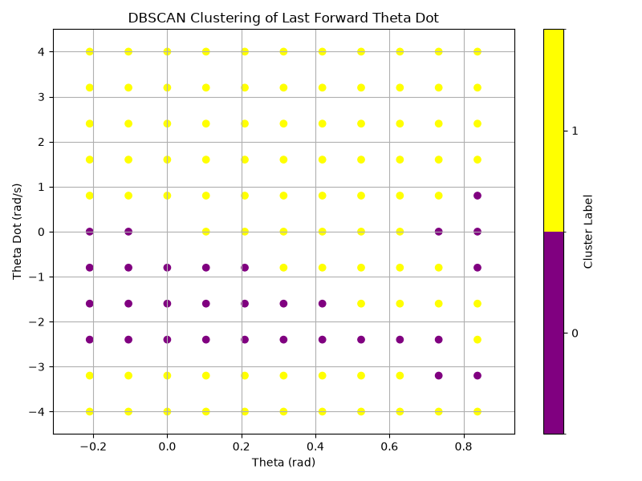
Above figure shows regions of attraction from various initial state (mass and length equals to 1, 6 spokes and $\gamma=\pi/10$).  The cluster label 0 (purple) means the trajectory evolves to stationary point (to a full stop), and label 1 (yellow) means it evolves to a continuously rolling limit cycle.

## Return-map plot
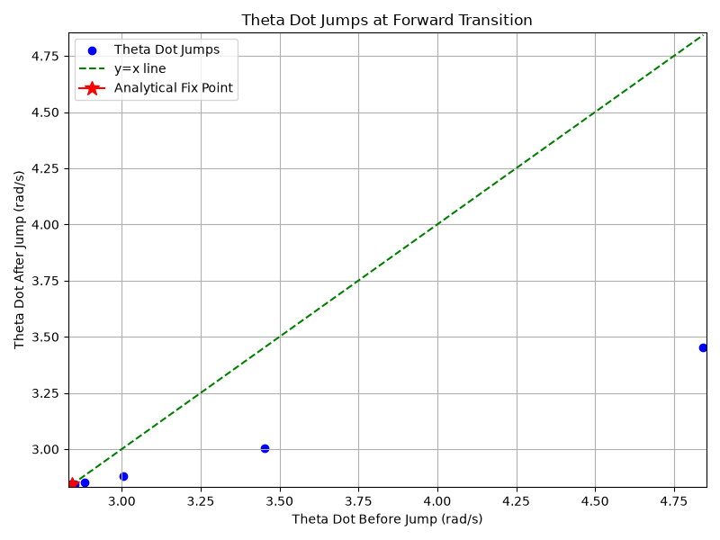
From the same setting as the previous picture, the above figure start with the analytical fix point $\bar{x}_0$ but with increased velocity $\bar{x}_0[1] \leftarrow \bar{x}_0[1] + 2$.  Blue dots are the velocity when the trajectory penetrate the Poincare section and we can see them getting closer to the left-bottom corner and to the y=x line, where we also mark the analytical fix point speed. 

## Impact of Slope
|$\gamma$|0.24|0.31|0.39|0.44|0.47|0.79|
|--|--|--|--|--|--|--|
|Floquet Multiplier|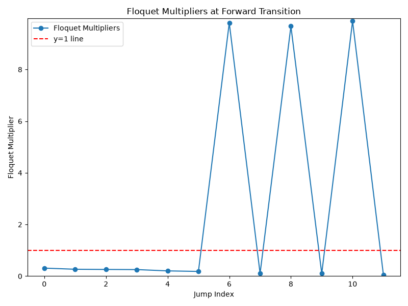|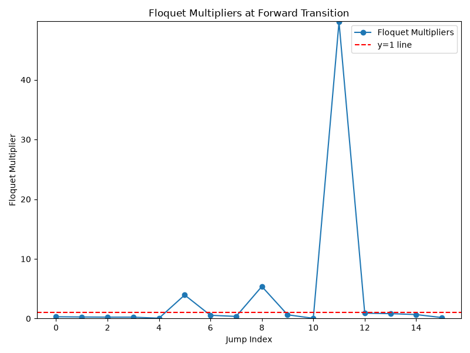|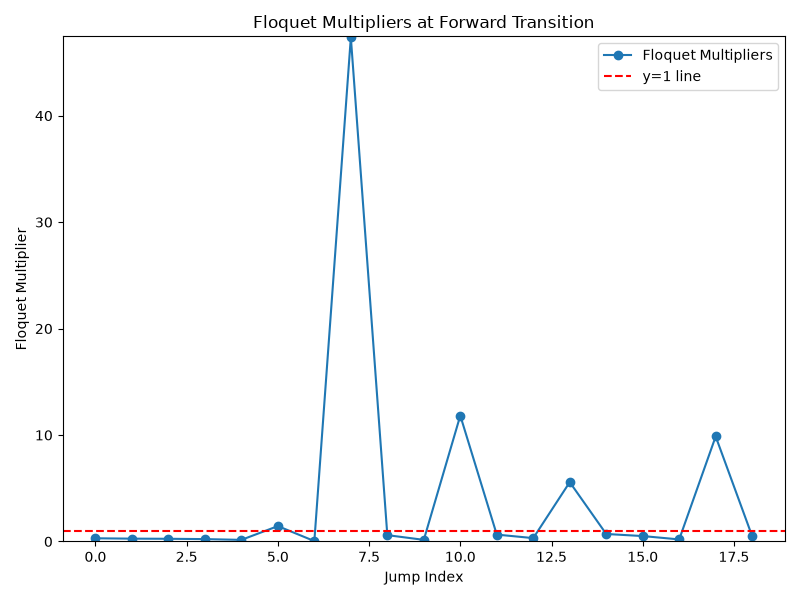|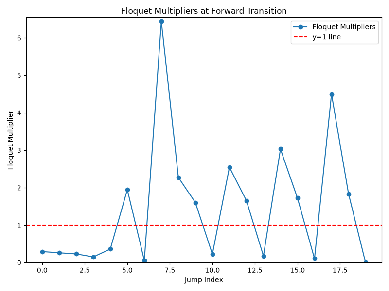|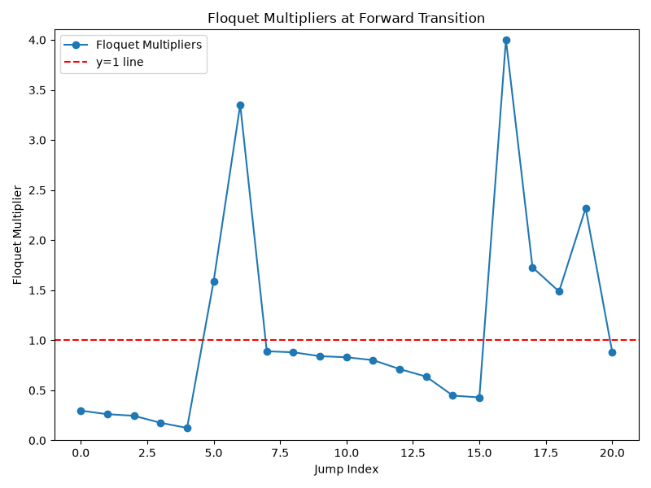|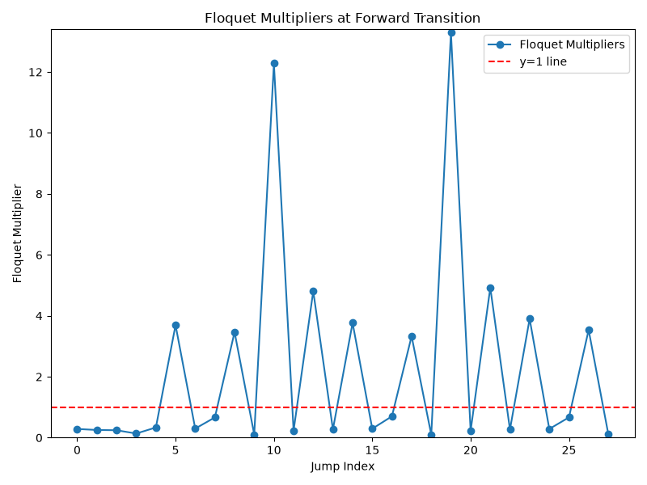|
|RoA|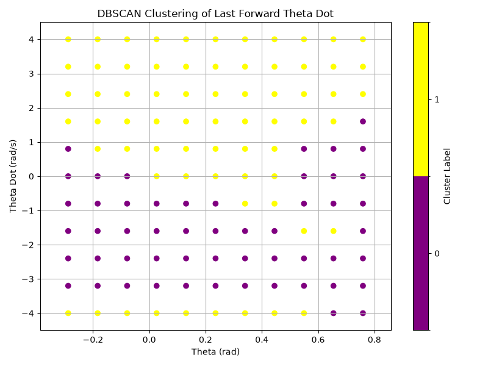||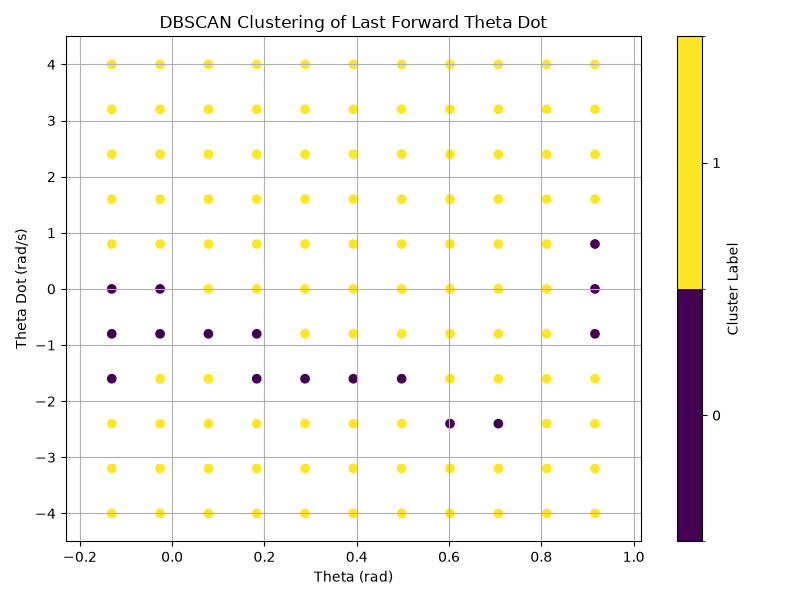|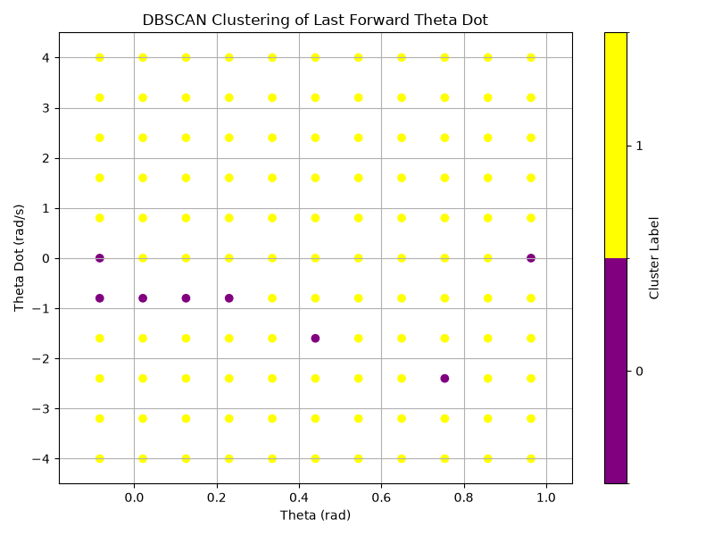|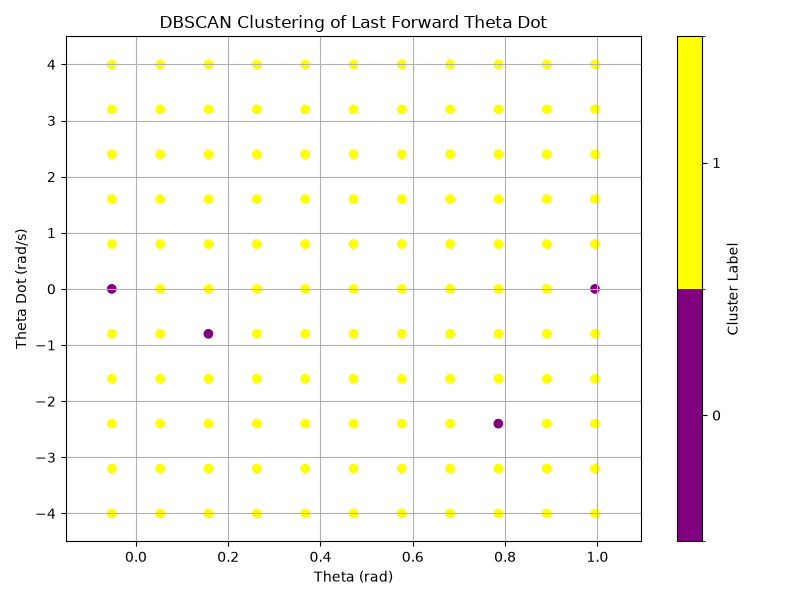|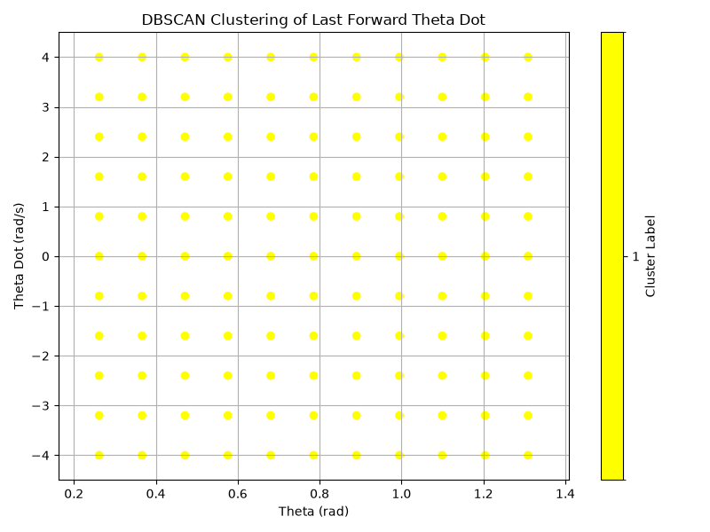|

The section considers mass and length equals to 1, 6 spokes and multiple different $\gamma$.

The initial Floquet multiplier does not change much across different $\gamma$.  I believe this is because the change of the speed is mainly govern by $cos(2\alpha)$ and the incline angle does not affect much about how energy decreases during the slowing down process.  The multiplier is very inprecise after 3 to 5 iterations since to continue the convergence, the time step has to be much smaller.

The range of attraction varies a lot.  When $\gamma$ is small, a larger region of initial condition (with less initial speed) fall back to the stationary fix point.  When the slope gets very steep, even if the wheel starts without speed, it will start rolling down.

## Number of Spokes
|Number of spokes|4|5|6|8|
|--|--|--|--|--|
|Floquet Multiplier|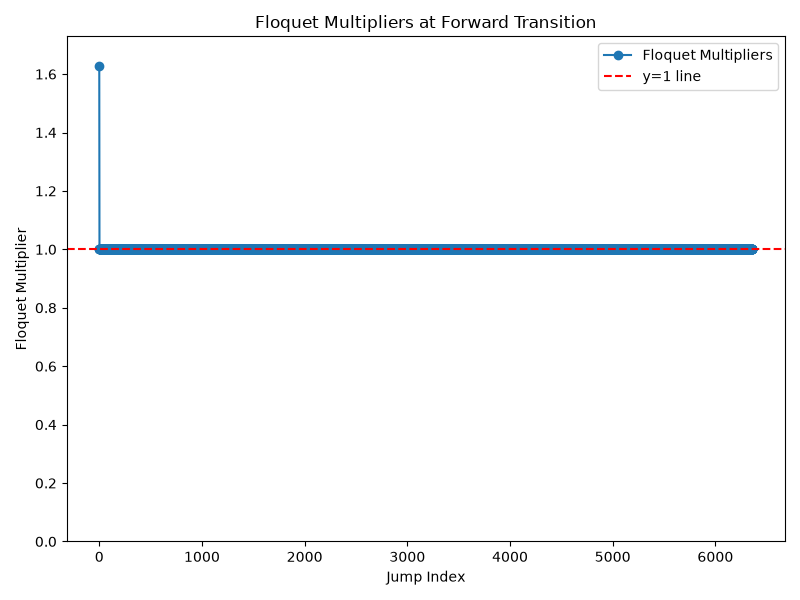|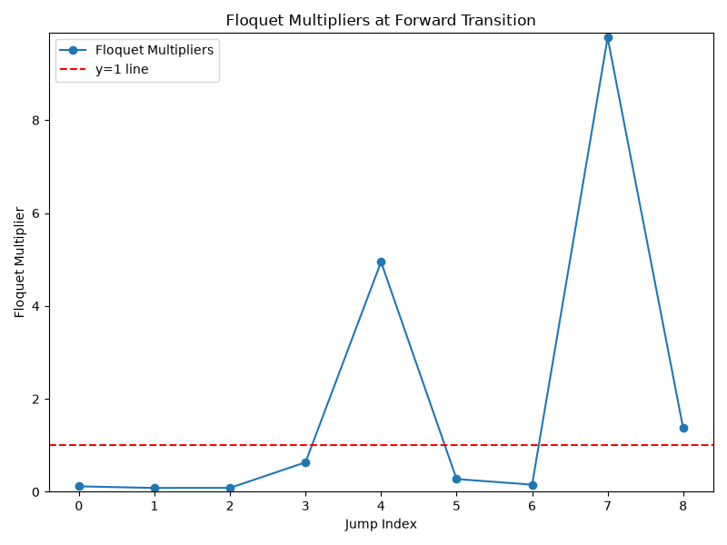||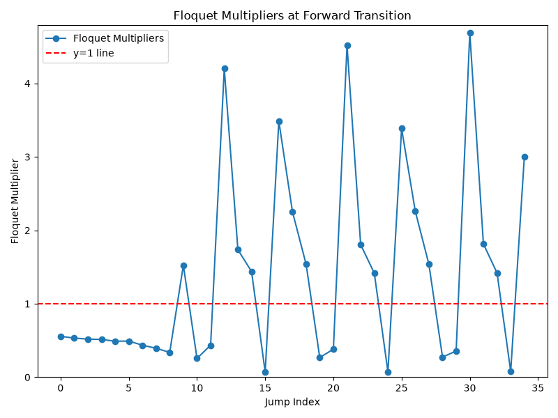|
|RoA|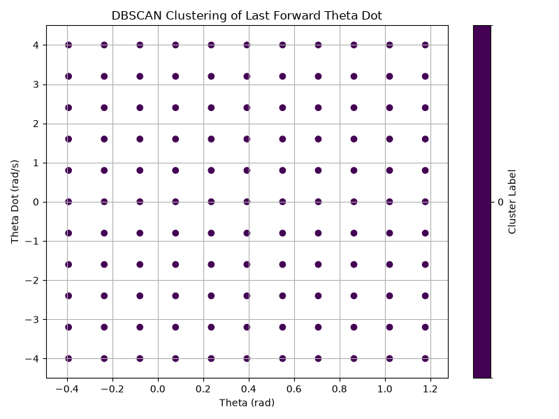|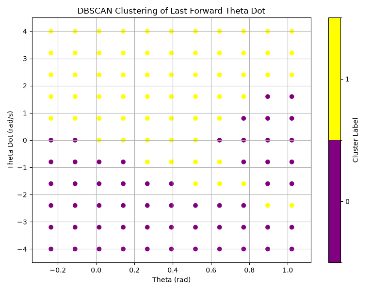||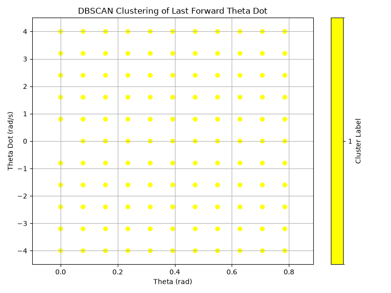|

The section considers mass and length equals to 1, different number of spokes and $\gamma=\pi/8$.   When spoke number is 4, we see that the wheel quickly stops, and the floquet multiplier stays at 1 since the speed of the wheel at the Poincare section does not change anymore.  Otherwise, as the number increase, the rimless wheel suffers less speed loss when the initial speed is faster than the limit cycle fix point value, and is slower to converge.  Similarly, from the range of attraction graph, we see that as the rimless wheel gets closer to an actual wheel, it is easier to continue to roll down the slop and the the limit cycle RoA occupies a larger region.  

## AI usage
### Agentic Coding
- Model used: Muse Spark 1.3 (opencode Go)
- Scopes
    - pytest integration
    - signature update

### Auto-completion
- Model used: Github Autopilot Auto-select
- Scopes
    - All code edits
    - Help the comment after manual code edits
    - Help writing the warning message